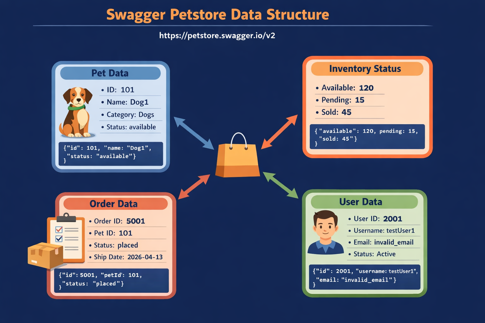

# Petstore API Automation Framework

API Test Automation framework for Swagger Petstore using Java, REST Assured, and Cucumber BDD.

## Tech Stack
| Tool | Purpose |
|------|---------|
| Java 11 | Programming language |
| REST Assured 5.4 | API testing library |
| Cucumber 7.15 | BDD framework |
| Maven | Build tool |
| Log4J 2 | Logging |
| Jackson | JSON serialization |
| JavaFaker | Dynamic test data |
| JUnit 4 | Test runner |

## Project Structure
```
petstore-api-automation/
├── src/
│   ├── main/
│   │   └── java/
│   │       └── com/veeva/
│   │           ├── config/
│   │           │   └── ConfigManager.java  
│   │           ├── models/
│   │           │   ├── Category.java
│   │           │   ├── Pet.java
│   │           │   └── User.java
│   │           └── utils/
│   │               ├── AssertUtils.java
│   │               └── TestDataGenerator.java
│   └── test/
│       ├── java/
│       │   └── com/veeva/
│       │       ├── context/
│       │       │   └── ScenarioContext.java
│       │       ├── hooks/
│       │       │   └── Hooks.java
│       │       ├── pages/
│       │       │   ├── BasePage.java
│       │       │   ├── PetPage.java
│       │       │   ├── StorePage.java
│       │       │   └── UserPage.java
│       │       ├── runners/
│       │       │   └── TestRunner.java
│       │       └── stepdefinitions/
│       │           ├── InventorySteps.java
│       │           ├── NegativePetSteps.java
│       │           ├── PetSteps.java
│       │           ├── StoreSteps.java
│       │           └── UserSteps.java
│       └── resources/
│           ├── features/
│           │   ├── TC1_PetLifecycle.feature
│           │   ├── TC2_InventoryAnalysis.feature
│           │   ├── TC3_UserSecurity.feature
│           │   └── TC4_CrossEndpoint.feature
│           ├── config.properties
│           └── log4j2.xml
├── .gitignore
├── pom.xml
└── README.md

```
##Feature Files

1) TC1: Pet Lifecycle (CRUD & Chaining)
    1)Create pet (POST /pet),Retrieve pet,Update pet,Delete pet
      validating the response as successful or not found
    2)delete existing pet and verify 404
    3)List filtering by status
    4)Negative scenarios 
        fetch non-existing pet with valid and invalid ids
        delete non-existing pet
2) TC2: Inventory Analysis
   1)Fetch the pets by status 
    validating the response is scuccessful
   2)Get the count from the inventory
    validate the response is scuccessful
   3)compare both the counts are approximately equal with 20% tolerance
    
3) TC3: User Security & Error Handling
   1)Create user with invalid email formats
    ensuring user creation esponse should not return a server error
   2)Positive Login- create a user with username and email
     login with the same username and password 
     Then the login should be successful
   3)Negative Login - create a user with username and email
     login with invalid username and password
     Then the login should be invalid
   4)Fetch a non-existent user returns 404
   

4) TC4: Cross-Endpoint Data Consistency
   1)Create pet with category
     Update status to "sold"
     Then the created pet ID should be found in the sold pets list
   2)Fetch sold pets list
   3)Validate created pet exists in sold list


### How to Run the Project

 1)Ensure that Java (version 8 or above) and Maven are installed on your system and properly configured in the 
environment variables before attempting to run the project.

 2)Clone the repository using git clone https://github.com/Varshitharaodugyala/petstore-api-automation.git
 and navigate into the project directory.
 
 3)Open the project in IntelliJ IDEA or any preferred IDE and allow Maven to download all required dependencies from the pom.xml file.
 
 4)Execute the command mvn clean test from the project root directory to build the project and run all Cucumber test scenarios.
 
 5)After execution, verify the results by opening the generated Surefire reports located in the target/surefire-reports folder.
 
 6)Optionally, you can run the test runner class directly from the IDE to execute specific scenarios during development.


### API Reference

The base URL for all API requests used in this framework is:
https://petstore.swagger.io/v2

The Swagger UI can be accessed using the following link, which provides interactive API documentation and allows manual testing of endpoints:
https://petstore.swagger.io/

## 🏗️ Architecture Diagram


   
